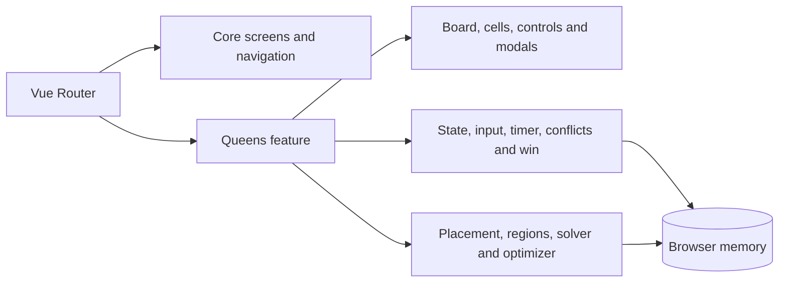

# AGENTS.md

## Project

**CrownGrid** is the display name for the `crown-grid` repository. It is a static Vue 3 and TypeScript application that generates and plays color-region Queens puzzles entirely in the browser.

## Product principles

- Keep the core experience browser-only, account-free, and understandable.
- Preserve the implemented rules: one queen per row, column, and color region; no corner-adjacent queens.
- Keep puzzle generation deterministic in its contracts even though individual boards are randomized.
- Prefer small typed utilities and focused composables over a framework or state library added without need.
- Treat algorithm performance, finite progress values, and input-listener cleanup as correctness concerns.
- Preserve the runtime fragment-based email construction unless an explicit story replaces it with an equally privacy-conscious approach.
- Do not publish the full email address in README or support documentation.
- Keep display branding (`CrownGrid`) separate from stable story identifiers (`CG-`) and document any repository-base change.

## Architecture



See `docs/architecture.md` and `docs/puzzle-generation.md`.

## Boundaries

- `src/core` owns navigation and informational screens.
- `src/features/queens/screens/QueensScreen.vue` orchestrates the game lifecycle.
- Feature components render props and emit user actions; they should not own puzzle algorithms.
- Composables own reactive state and interaction behavior.
- Utilities own typed-array puzzle generation, validation, counting, and optimization.
- No source module should call a backend because CrownGrid has no backend.
- Branding-only changes must not silently alter puzzle rules, generation limits, or history behavior.

## Current release scope

Release 0.1 covers identity, README, favicon, documentation, release evidence, and focused AI-assisted engineering files. It does not authorize a puzzle-engine rewrite.

Release 0.2 contains one planned hardening story, `CG-005`, limited to:

- consistent `CellState` initialization;
- finite optimizer best/progress values;
- one bounded touch/pointer listener path;
- timer, replay, and generation-error recovery correctness;
- correctly targeted contact-card email assembly while preserving obfuscation.

A Web Worker migration, broad `QueensScreen` controller extraction, UI redesign, persistence, authentication, backend services, and dependency modernization remain out of scope unless a later story introduces them.

## Codex workflow

Use only the smallest relevant role:

- `architect` for cross-cutting state, lifecycle, routing, or deployment changes;
- `implementation_worker` for one bounded story or defect;
- `algorithm_reviewer` for generator, solver, optimizer, typed-array, and complexity review;
- `reviewer` for final behavior, accessibility, privacy, documentation, and evidence review.

Repository skills:

- `vue-feature-delivery` — Vue components, composables, routes, state, and build changes;
- `queens-puzzle-algorithms` — placement, connected regions, solution counting, and optimization;
- `accessibility-responsive-ui` — keyboard, pointer/touch, semantics, responsive layout, and status feedback;
- `release-evidence` — story status, verification, documentation, and release boundaries.

Do not invoke every role for a small edit. Prefer one write-owning agent at a time.

## License headers

The repository uses Apache-2.0. New hand-authored, project-specific source files use:

```text
SPDX-FileCopyrightText: 2026 Keresztes Zsolt <https://kereszteszsolt.hu>
SPDX-License-Identifier: Apache-2.0
```

Do not add `Present`. Do not add the header to Markdown, JSON, TOML, YAML, generated lock files, standard configuration files, or binary assets.

## Verification

Before claiming a code story is implemented, run the relevant checks:

```bash
npm ci
npm run build
```

Then complete the manual smoke path in `docs/testing.md`. The current baseline has no automated unit-test or lint script, so do not claim test coverage that does not exist. A story adding tests must name the runner, test scope, and exact command.
