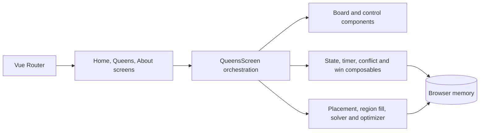

<p align="center">
  
</p>

<h1 align="center">CrownGrid</h1>

<p align="center">
  <strong>Queens Puzzle Generator &amp; Game</strong><br>
  <em>Generate. Place. Solve.</em>
</p>

<p align="center">
  <a href="docs/releases/release-0.1-crowngrid-foundation/README.md"></a>
  
  
  
  <a href="LICENSE"></a>
</p>

**CrownGrid** is a browser-based puzzle generator and game for the color-region Queens ruleset. It creates a square board with connected color regions, searches for a requested maximum number of solutions, and lets the player solve the result without accounts, tracking, or a backend.

[Play CrownGrid](https://kereszteszsolt.github.io/crown-grid/) · [User guide](docs/user-guide.md) · [Architecture](docs/architecture.md) · [Puzzle generation](docs/puzzle-generation.md) · [All documentation](docs/README.md)

## Highlights

- Generate boards from **4×4 through 15×15** with targets of at most **1, 5, or 10 solutions**.
- Solve with exactly one queen in every row, column, and color region, while avoiding diagonally adjacent queens.
- Mark impossible cells, drag to paint or erase marks, undo moves, reset the board, and shuffle region colors.
- Run entirely as a static Vue application. The current game state stays in browser memory and is not sent to a server.
- Inspect generation progress, elapsed time, iteration limits, and the best result returned by the optimizer.

## Rules and controls

A completed board contains one queen in each row, one in each column, and one in each connected color region. Queens may not touch at a corner.

- **Single click or tap:** add or remove an `X` mark.
- **Double click or double tap:** place a queen. CrownGrid automatically marks cells excluded by its row, column, color-region, and corner rules.
- **Click an existing queen:** remove it together with the automatic marks created for that queen.
- **Drag:** paint or erase `X` marks across cells.

See the [user guide](docs/user-guide.md) for the complete workflow and troubleshooting notes.

## Architecture



The application has no backend. Puzzle generation and solution counting run in the browser. Read the [architecture guide](docs/architecture.md) and [generation guide](docs/puzzle-generation.md) before changing the game state or algorithm boundaries.

## Quick start

### Prerequisites

- Node.js `^20.19.0` or `>=22.12.0`
- npm

### Development

```bash
git clone https://github.com/kereszteszsolt/crown-grid.git
cd crown-grid
npm ci
npm run dev
```

Open `http://localhost:5173/crown-grid/`.

### Production build

```bash
npm run build
npm run preview
```

### GitHub Pages

```bash
npm run deploy
```

The Vite base path is `/crown-grid/`. Update [`vite.config.ts`](vite.config.ts), the package metadata, and documentation together if the repository name changes again.

## Documentation and releases

- [Documentation index](docs/README.md)
- [User guide](docs/user-guide.md)
- [Architecture](docs/architecture.md)
- [Puzzle-generation and solver contract](docs/puzzle-generation.md)
- [Development guide](docs/development.md)
- [Testing and verification](docs/testing.md)
- [Brand configuration](docs/brand-configuration.md)
- [Privacy and contact boundaries](docs/privacy-and-contact.md)
- [Release index](docs/releases/README.md)
- [Release 0.1: CrownGrid foundation](docs/releases/release-0.1-crowngrid-foundation/README.md)
- [Release 0.2: Essential hardening](docs/releases/release-0.2-essential-hardening/README.md) — planned

## Project identity

| Property | Canonical value |
| --- | --- |
| Product | `CrownGrid` |
| Descriptor | `Queens Puzzle Generator & Game` |
| Repository and package | `crown-grid` |
| GitHub Pages base | `/crown-grid/` |
| Story prefix | `CG-` |
| Maintainer | Keresztes Zsolt — [kereszteszsolt.hu](https://kereszteszsolt.hu/) |

Release 0.1 applies the approved identity and documentation without refactoring the puzzle engine. The narrowly scoped follow-up findings are recorded in [CG-005](docs/releases/release-0.2-essential-hardening/stories/CG-005-essential-code-hardening.md).

## AI-assisted engineering

Optional repository roles are defined for [`architect`](.codex/agents/architect.toml), [`implementation_worker`](.codex/agents/implementation-worker.toml), [`algorithm_reviewer`](.codex/agents/algorithm-reviewer.toml), and [`reviewer`](.codex/agents/reviewer.toml). Reusable workflows live in [`.agents/skills`](.agents/skills), while [`AGENTS.md`](AGENTS.md) is the source of truth for scope and working agreements.

These files support development only and are not CrownGrid runtime dependencies.

## Privacy

CrownGrid does not include accounts, analytics, cookies, a database, or an application backend. The active puzzle and timer exist in browser memory and reset on reload. The About screen retains its fragment-based runtime email construction as a basic anti-harvesting measure; the README and support documentation intentionally publish no email address. See [privacy and contact boundaries](docs/privacy-and-contact.md).

## Support and contact

**Project maintainer: Keresztes Zsolt**

| Platform | Link |
| --- | --- |
| Website | [kereszteszsolt.hu](https://kereszteszsolt.hu/) |
| GitHub | [@kereszteszsolt](https://github.com/kereszteszsolt) |
| Project support | [SUPPORT.md](SUPPORT.md) |

> The maintainer's website is available in Hungarian (HU), English (EN), Romanian (RO), and German (DE).

## ☕ Ways to support

**Explore ways to support the maintainer and their projects.**

[https://kereszteszsolt.hu/ways-to-support/](https://kereszteszsolt.hu/ways-to-support/)

<p align="center">
  <a href="https://buymeacoffee.com/kereszteszsolt"></a><br>
  <strong>Every coffee counts! ☕❤️</strong>
</p>

## License

Apache License 2.0. See [`LICENSE`](LICENSE).

---

<p align="center">
  <strong>Made with ❤️ by <a href="https://kereszteszsolt.hu/">Keresztes Zsolt</a></strong><br>
  ⭐ Star this repository if you found it helpful!
</p>
