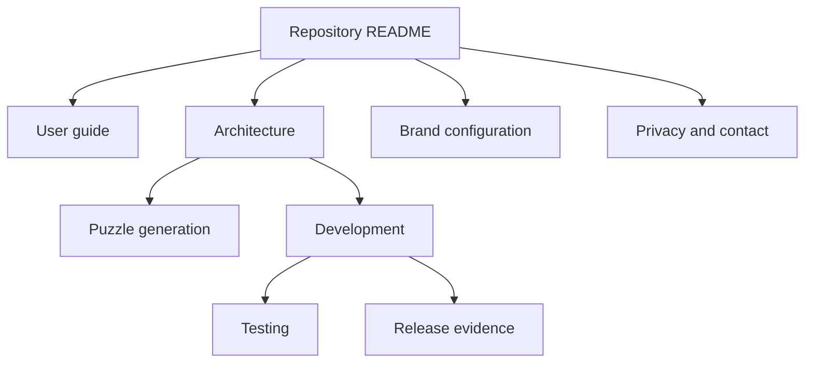

# CrownGrid documentation

## Start here

| Document | Purpose |
| --- | --- |
| [User guide](user-guide.md) | Generate, start, solve, reset, and troubleshoot a puzzle |
| [Architecture](architecture.md) | Runtime boundaries, state flow, routes, and known constraints |
| [Puzzle generation](puzzle-generation.md) | Placement, connected regions, solver, optimizer, and invariants |
| [Development](development.md) | Setup, repository map, coding conventions, and release workflow |
| [Testing](testing.md) | Build verification and the repeatable manual smoke matrix |
| [Brand configuration](brand-configuration.md) | Canonical CrownGrid names, visual identity, and rename rules |
| [Privacy and contact](privacy-and-contact.md) | Browser-only data boundary and email-obfuscation requirements |
| [Release index](releases/README.md) | Implemented repository foundation and planned hardening |

## Documentation map

Documentation describes the supplied CrownGrid source plus the repository-level Release 0.1 additions. Planned behavior is explicitly marked and belongs to Release 0.2.
