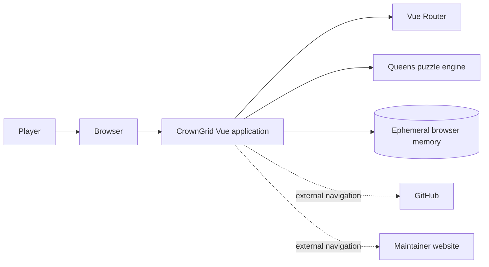
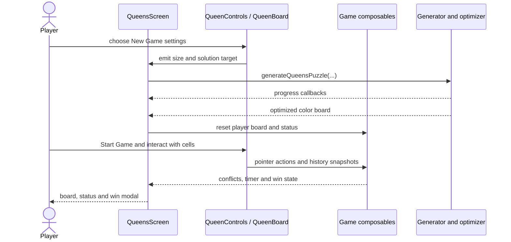

# CrownGrid architecture

## System context

CrownGrid is a static single-page application. Vue renders the interface, Vue Router selects screens, composables hold reactive game state, and TypeScript utilities generate and evaluate puzzles. There is no application server or persistent data store.



## Repository modules

```text
src/
├── core/
│   ├── components/       navigation and shared spinner
│   ├── routes/           home and about routes
│   └── screens/          product and legal/contact pages
├── features/queens/
│   ├── components/       board, cells, controls, modals and status cards
│   ├── composables/      state, pointer input, timer, conflicts and win logic
│   ├── constants/        EMPTY, QUEEN and X_MARK values
│   ├── models/           typed state and generation contracts
│   ├── routes/           /queens route
│   ├── screens/          QueensScreen orchestration
│   └── utils/            generator, region fill, solver and optimizer
└── router/               combined router
```

## Component and state flow



`QueensScreen.vue` is currently the lifecycle coordinator. Components should remain presentation-focused, composables should own reactive behavior, and utility functions should remain independent from Vue where possible.

## Core state contracts

### Puzzle board

The generated challenge is a `number[][]` derived from an `Int8Array`. Values `1..size` identify color regions. A valid puzzle has exactly one connected orthogonal region for each color.

### Player board

Each player cell is a `CellState`:

```ts
interface CellState {
  data: number;
  lastModified: number;
}
```

`data` is `EMPTY`, `QUEEN`, or `X_MARK`. `lastModified` associates automatic `X` marks with the queen that created them. Empty-board construction creates an independent conforming object for every cell.

### Game status

The status union contains `welcome`, `generating`, `generatingError`, `boardGenerated`, `playing`, and `won`. UI availability and input guards depend on this status, so lifecycle changes must be reviewed together with timer behavior and control visibility.

## Route contract

| Path | Screen |
| --- | --- |
| `/` | Home |
| `/queens` | Puzzle generator and game |
| `/about` | Project, privacy, license, technology, and contact information |
| any other path | Redirect to `/` |

`createWebHistory(import.meta.env.BASE_URL)` and the Vite base `/crown-grid/` must remain aligned for GitHub Pages.

## Privacy and persistence boundary

CrownGrid stores no game data in local storage, IndexedDB, cookies, or a backend. Reactive state is lost on reload. The About screen builds its email link from fragments at runtime; this is a basic harvesting deterrent rather than a security boundary. See [privacy and contact](privacy-and-contact.md).

## Implemented bounded hardening

[CG-005](releases/release-0.2-essential-hardening/stories/CG-005-essential-code-hardening.md) implements state-field consistency, finite optimizer values, one board-owned touch listener, generation-error and replay timer lifecycle, and email-card targeting. A Web Worker, state-machine library, persistence layer, or broad screen extraction remains outside that story.
