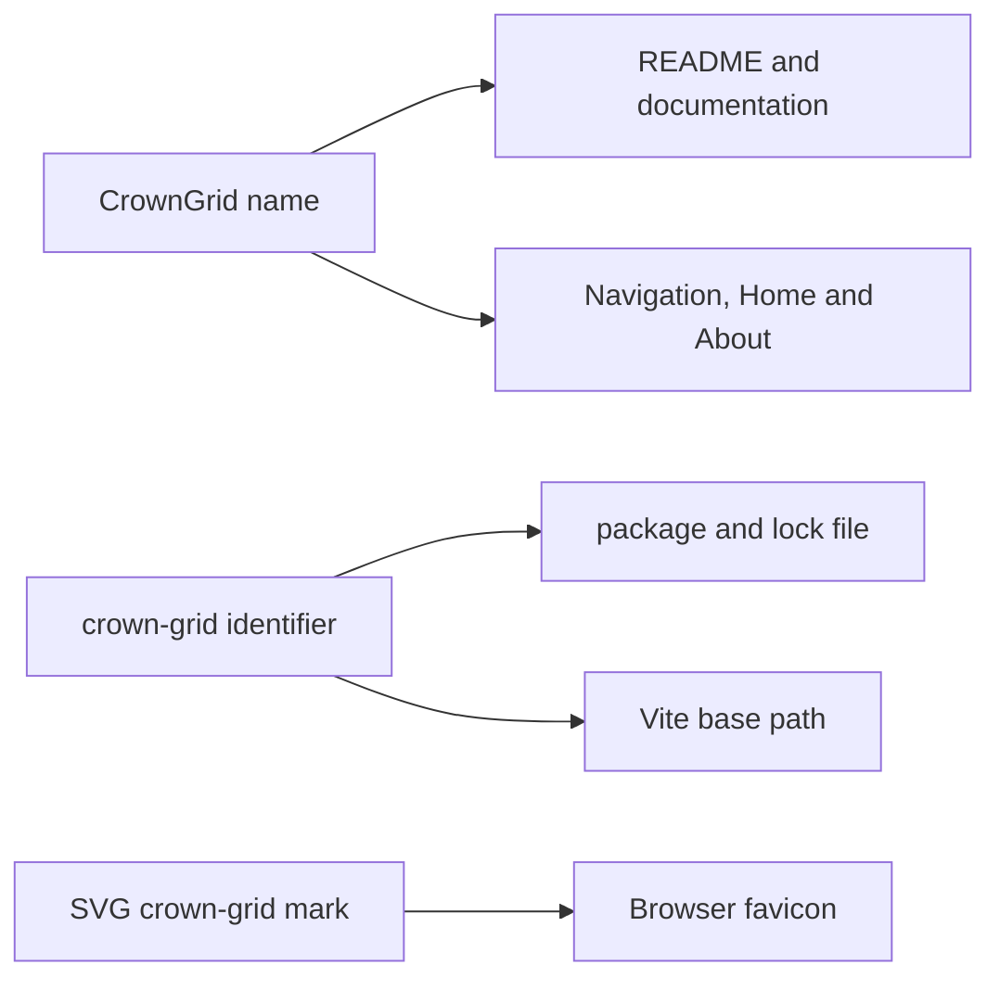

# CrownGrid brand configuration

## Canonical identity

| Purpose | Value |
| --- | --- |
| Product name | `CrownGrid` |
| Product descriptor | `Queens Puzzle Generator & Game` |
| Tagline | `Generate. Place. Solve.` |
| Repository | `crown-grid` |
| npm package | `crown-grid` |
| GitHub Pages base | `/crown-grid/` |
| Story prefix | `CG-` |
| Maintainer | Keresztes Zsolt |
| Maintainer website | `kereszteszsolt.hu` |

Use `CrownGrid` as one word in display copy. Use `crown-grid` for repository, package, URL-path, and other kebab-case technical identifiers.

## Product mark

`public/favicon.svg` is the canonical compact mark: a light crown over a subtle grid on the existing coral accent. It is designed to remain recognizable at small browser-tab sizes without depending on an external font.

## Existing visual palette

Release 0.1 retains the application's current design tokens rather than introducing a redesign.

| Role | Value |
| --- | --- |
| Primary / favicon background | `#ff7f50` coral |
| Secondary | `#228b22` forest green |
| Tertiary | `#00bfff` deep sky blue |
| Neutral background | `#fffaf0` floral white |
| Error | `#ac1010` dark red |

Future palette changes must check board-color distinguishability, conflict patterns, contrast, and the favicon separately.

## Voice

- Prefer direct, factual language over claims such as unlimited or guaranteed instant generation.
- Describe the exact ruleset, especially corner adjacency rather than classic full-diagonal attacks.
- State performance limits honestly: large boards can require significant browser CPU time.
- Keep privacy language precise: state is ephemeral browser memory, not persistent local storage.

## Contact and support rule

README and the user guide publish the maintainer website and GitHub profile, but no email address. The About screen retains fragment-based runtime email construction. A future implementation may improve how the email card is targeted, but must not replace the fragments with a plain address in public documentation.

## Rename checklist

If the repository name changes:

1. update package and lock metadata;
2. update the Vite base and GitHub Pages URL;
3. update README, support, source, issue, and release links;
4. preserve `CG-` story history unless a deliberate migration is documented;
5. preserve puzzle behavior and runtime contact privacy independently from display branding;
6. verify navigation and deep links from the production build.
