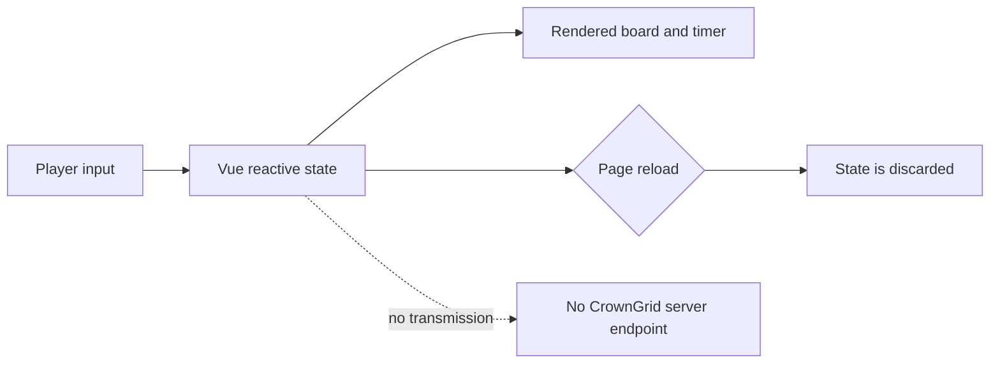

# CrownGrid privacy and contact boundaries

## Runtime data flow

CrownGrid is a static browser application. It does not contain an application backend, account system, analytics integration, cookie banner, database, or network API for game state.

The generated puzzle, player marks, history, timer, and status are held in memory. Reloading the page discards them.

## External links

The Home and About screens contain links to GitHub, GitHub Pages information, technology websites, the maintainer's website, and UXWing. Following one of these links leaves CrownGrid; the destination service controls its own data practices.

## Email anti-harvesting mechanism

The About screen stores the email components as separate string fragments and assembles the visible address and `mailto:` target at runtime. This can reduce the usefulness of simple static-source harvesting, but it is not encryption and cannot prevent a browser-capable crawler from reading the rendered page.

Repository rules:

- keep the fragment-based runtime construction unless an explicit story approves another privacy-conscious mechanism;
- do not add the full address to README, the user guide, release notes, or other Markdown documentation;
- target only the email contact card when assigning rendered text or a `mailto:` link;
- never allow a generic selector to rewrite the GitHub or website contact card;
- verify the three contact cards independently after changes.

Release 0.2 implements this boundary with a dedicated `data-contact="email"` target and a nested email-value lookup. Independent browser checks verify that the GitHub and website cards retain their original targets.

## Reporting a privacy concern

Use the project's GitHub Issues for a repository-specific privacy or documentation concern, or use the maintainer website for broader contact options. Do not place personal information in a public issue.
