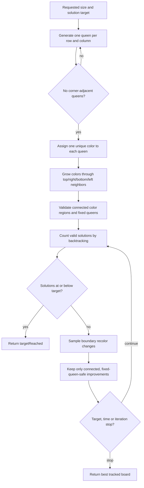

# CrownGrid puzzle generation

## Rules encoded by the engine

For an `N×N` board, a valid solution contains `N` queens with:

- one queen in each row;
- one queen in each column;
- one queen in each of the `N` color regions;
- no pair of queens on diagonally adjacent cells.

The long diagonals used by classic N-Queens are not part of this ruleset.

## Generation pipeline

## Queen placement

`generateQueenPlacement` uses backtracking over a shuffled column order. It places one queen per row, rejects used columns, and calls `hasCornerQueen` to reject diagonal-neighbor conflicts. The result is an `Int8Array` containing `QUEEN` and `EMPTY` values.

## Connected color regions

`fillBoardWithColors` assigns a unique color `1..N` to every queen cell, then grows each color through orthogonal neighbors. Random sampling chooses which neighbor spreads or receives a color. A bounded fallback fills at least one reachable empty cell when random propagation stalls.

The generated board is valid only when:

- every cell has a color in `1..N`;
- each color appears as one orthogonally connected region;
- every fixed queen occupies a unique color.

## Solution counting

`countQueensSolutions` groups cells by color and sorts regions from smallest to largest. Its depth-first search places one queen per region while tracking used rows and columns and rejecting corner adjacency. An optional limit stops counting early when the caller only needs to know that a threshold was exceeded.

```mermaid
flowchart LR
    REGIONS[Color regions sorted by size] --> DFS[Depth-first search]
    DFS --> ROWS[Unused row?]
    ROWS --> COLS[Unused column?]
    COLS --> DIAG[No corner-adjacent queen?]
    DIAG --> NEXT[Place queen and recurse]
    NEXT --> SOLUTION[Count complete assignment]
    SOLUTION --> LIMIT[Stop early at optional limit]
```

## Optimization

`optimizeQueensPuzzle` validates the initial board, counts solutions, then repeatedly samples small recolor changes. A change is accepted only when it:

1. keeps the fixed generated queens on distinct colors;
2. keeps every color region valid and connected;
3. produces at least one solution;
4. strictly reduces the current solution count.

Default stop limits are three minutes and two million iterations. Boards larger than `12×12` first use a strategic solution cap and may regenerate region fills before full optimization.

## Progress contract

Generation progress reports iteration, current and best solution counts, elapsed time, success rate, size, limits, target, and refill count. The optimizer initializes the best state from the evaluated initial board and reports a zero success rate before any attempt, keeping iteration-zero progress finite.

## Performance boundary

The solver and optimizer are CPU-intensive and currently execute in the browser's main JavaScript environment. Periodic zero-delay yields allow some UI updates, but a single solution-count call can still block rendering. Moving generation to a Web Worker may be valuable later, but it is intentionally outside the essential Release 0.2 hardening scope.

## Change checklist

Before changing the algorithm:

- preserve all four rule invariants;
- keep typed-array lengths equal to `size * size`;
- keep color values within `1..size`;
- ensure a returned board has at least one solution;
- keep stop reasons and progress data accurate;
- add focused evidence for small, medium, and large boards;
- distinguish performance optimization from rule changes.
