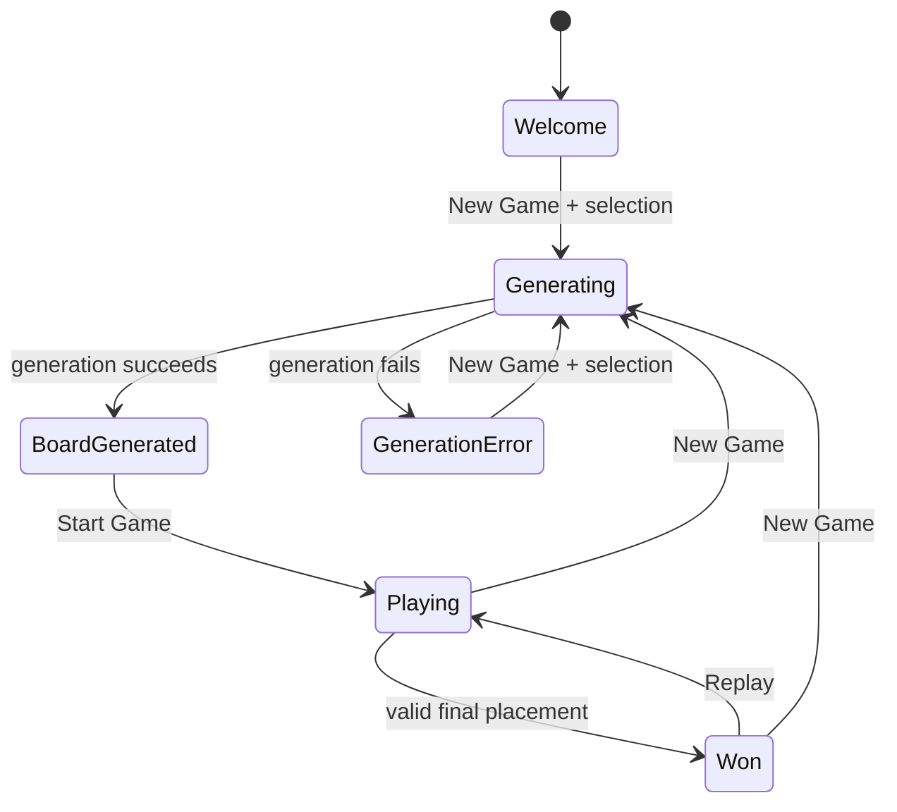

# CrownGrid user guide

## Open the application

The hosted application is available at `https://kereszteszsolt.github.io/crown-grid/`. A local development server uses `http://localhost:5173/crown-grid/` because the Vite base path matches the repository name.

## Generate a puzzle

1. Open **Queens** from the navigation.
2. Select **New Game**.
3. Choose a board size from `4` through `15`.
4. Choose a target of at most `1`, `5`, or `10` solutions.
5. Leave the generation screen open until CrownGrid returns a board or reports an error.
6. Select **Start Game** after the board is generated.

Larger boards and stricter solution targets require more browser CPU time. The optimizer stops after reaching the target, the configured three-minute time limit, or the iteration limit. It returns the best evaluated board with a finite solution count even when no optimization iteration runs or no improvement is accepted.

## Solve the board

Place exactly one queen in every:

- row;
- column;
- connected color region.

Two queens may not be diagonally adjacent. CrownGrid's rule checks corner adjacency only; it does not prohibit every long diagonal as in the classic N-Queens problem.

### Cell interactions

| Action | Result |
| --- | --- |
| Single click or tap an empty cell | Place an `X` mark |
| Single click or tap an `X` | Remove the mark |
| Double click or double tap a cell | Place a queen |
| Click or tap an existing queen | Remove the queen and its automatically created marks |
| Drag from an empty cell | Paint `X` marks |
| Drag from an `X` | Erase `X` marks |

When a queen is placed, CrownGrid automatically marks currently empty cells in the same row, column, and color region, plus the four diagonal-neighbor cells. These marks are hints and remain associated with the queen placement through their modification timestamp.

## Game lifecycle

## Controls

- **New Game:** open the board-size and target selector.
- **Start Game:** unblur a generated board and enter the playable state.
- **Replay / Reset Game:** clear player moves while retaining the generated puzzle.
- **Shuffle Colors:** remap region colors without changing region shapes or the solution structure.
- **Clear Board:** remove player placements and add the cleared state to undo history.
- **Undo:** restore the previous recorded board snapshot.

## Conflict feedback

CrownGrid highlights conflicts when:

- a row contains more than one queen;
- a column contains more than one queen;
- a color region contains more than one queen;
- two queens touch diagonally at a corner.

## Privacy

The application has no account, analytics, cookie, database, or backend. The current puzzle and timer are held in browser memory and reset on reload. External navigation to GitHub or the maintainer's website leaves CrownGrid and follows the destination site's own policies.

## Troubleshooting

### The board takes a long time to generate

Choose a smaller board or allow up to five or ten solutions. Generation runs in the browser's main JavaScript environment in the current release, so demanding boards can temporarily reduce interface responsiveness.

### The board is generated but I cannot place marks

Select **Start Game**. A generated board remains intentionally non-interactive until the game enters the playing state.

### A double tap creates an unexpected mark first

The current interaction model records the first tap as an `X`, then uses undo when the second tap converts the cell to a queen. Release 0.2 keeps this behavior while moving touch movement ownership to one board-level listener.

### Generation failed

The timer remains stopped. Select **New Game** to reopen the board-size and solution-target selector and retry with the same or different settings.

### Replay the current puzzle

Both the win-modal **Replay** button and the main Replay control clear the player board, reset the timer, and restart the current puzzle consistently.

### Reloading removed my game

This is expected. CrownGrid does not currently persist game state.

## Further help

Search the repository's [GitHub Issues](https://github.com/kereszteszsolt/crown-grid/issues) before reporting a reproducible defect, build problem, or documentation correction. Include the CrownGrid version or commit, browser and operating system, board size and solution target, reproduction steps, and expected and observed behavior. Do not attach personal information or private browser data.
